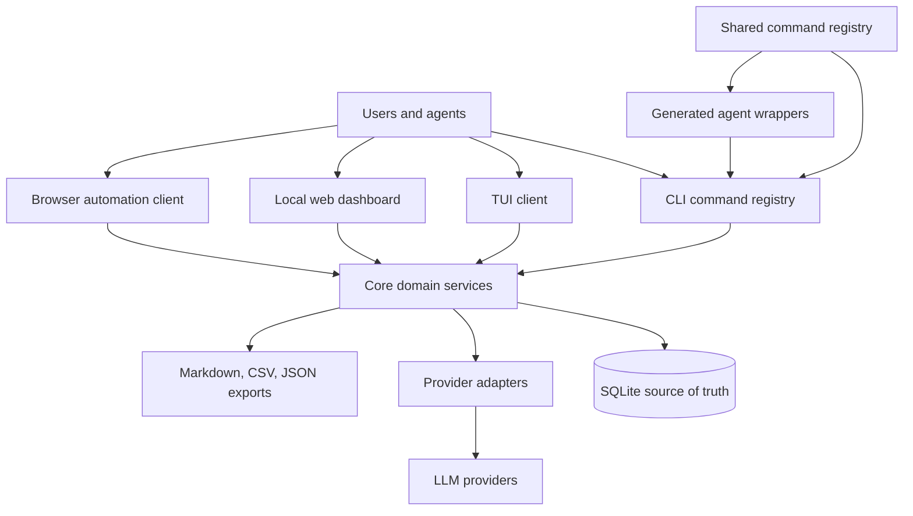
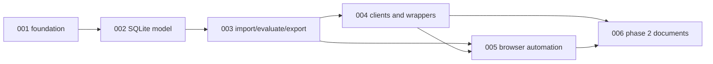

# res2jobWorks Project Roadmap

`PLAN.md` is the project-level roadmap and status index. Keep implementation
detail in `.vault/plans/`, durable decisions in `.vault/decisions/`, and
strategic human-facing summaries in the Obsidian project note.

## Current State

- `res2jobWorks` is a public-generic, local-first job-search workbench that supersedes the earlier `Res2JobFit` idea.
- Plan 001 bootstrap implementation is complete: the repo has a Python-first monorepo scaffold, core command contracts, portable config defaults, a packaged starter registry, public fixtures, and behavior-first tests.
- Plan 002 SQLite persistence is complete: explicit SQLite migrations, repository APIs, fixture seeding, status constraints, source fallback, privacy/path guards, and database tests are implemented without exposing workflow commands as available; the two-plan refactorer gate is also published.
- Plan 003 import/evaluate/export workflows are complete: command handlers initialize workspaces, import fixture-safe profile/job sources, create deterministic cited evaluations, track applications, and generate Markdown/CSV exports from SQLite.
- Plan 004 interfaces and wrappers are complete: CLI direct commands and `res2jobworks run`, read-only TUI/web dashboards, and registry-generated agent wrappers all call shared core command envelopes.
- Plan 005 browser automation is complete locally: browser-free capture contracts import reviewed job text through `jobs.import`, persist sanitized source URL/timestamp/artifact metadata in canonical `job_sources` records, expose CLI/agent registry commands, and keep fill-review plans non-submitting by default.
- The locked product direction is MVP 1 evaluation and tracking, with resume tailoring, cover letters, and document generation deferred to phase 2.
- The current planning packet was grounded in the prior Codex session `019e8a43-f147-7a81-8062-3f2b3c53641d`, the repo starter files, and the two Obsidian project notes listed below.

## Read First

- `AGENTS.md`
- `README.md`
- `.vault/research/project-context-2026-06-03.md`
- `.vault/research/predecessor-res2jobfit-and-career-ops-2026-06-03.md`
- `.vault/decisions/foundational-architecture-2026-06-03.md`
- `/home/gilgames/Vault/02_Areas/Career/Res2JobWorks-Plan.md`
- `/home/gilgames/Vault/01_Projects/res2jobworks/res2jobworks.md`
- Prior session archive: `/mnt/c/Users/gilgames/.codex/sessions/2026/06/02/rollout-2026-06-02T17-36-09-019e8a43-f147-7a81-8062-3f2b3c53641d.jsonl`

## Active Plans

| Feature Plan | Feature | Status | Next Action |
|---|---|---|---|
| `.vault/plans/001-bootstrap-core-contracts-2026-06-03.md` | Monorepo foundation, Python project, public fixtures, command envelope, and test harness | Complete | Committed as bootstrap implementation; plan 002 is next |
| `.vault/plans/002-sqlite-evaluation-tracking-model-2026-06-03.md` | SQLite schema, migrations, repositories, and domain contracts | Complete | Published with follow-up refactorer gate |
| `.vault/plans/003-import-evaluate-export-workflows-2026-06-03.md` | Profile/job import, rubric evaluation, citations, and Markdown/CSV exports | Complete | Published |
| `.vault/plans/004-interfaces-and-agent-wrappers-2026-06-03.md` | CLI, TUI, local web dashboard, and generated agent wrappers over shared commands | Complete | Commit/push plan 004, then run two-plan refactorer gate |
| `.vault/plans/005-browser-automation-human-review-2026-06-03.md` | Safe job-source capture and application-assist automation with human review | Complete | Commit and publish |
| `.vault/plans/006-tailoring-documents-phase2-2026-06-03.md` | Resume tailoring, cover letters, application answers, and document rendering | Deferred | Start only after MVP 1 evaluation/tracking is proven |

## Active Goal Runs

| Goal Run | Coordinates | Status | Next Action |
|---|---|---|---|
| `.vault/goals/goal-mvp-evaluation-tracking-2026-06-03/` | Plans 001-004, with plans 005-006 as follow-on lanes | Planned | Read `handoff.md`, then activate native `/goal` or run `$lfg` |

## Primary Goals

1. Build a public-generic local-first job-search workbench that never assumes one user's private resume, tracker, or application history.
2. Make SQLite the canonical source of truth for profiles, jobs, evaluations, citations, applications, notes, exports, and agent runs.
3. Expose the same product truth through CLI, TUI, web UI, browser automation, and generated agent wrappers.
4. Keep LLM-backed evaluation cited, reversible, labeled, and inspectable.
5. Defer tailoring and document generation until the evaluation/tracking loop is stable.

## Success Criteria

- [x] A public monorepo exists with Python-first core packages, app folders, public fixtures, docs, and behavior-first tests.
- [x] A SQLite-backed core can initialize a workspace, persist profiles/jobs/evaluations/applications, and preserve status history.
- [x] Import/evaluate/export workflows create cited evaluation records and Markdown/CSV exports without treating exports as canonical data.
- [x] CLI, TUI, web dashboard, and generated agent wrappers call the same command registry and return the same stable command envelope.
- [x] Browser automation is limited to extraction, draft, fill, review, and evidence capture unless a user explicitly confirms submission outside the default product path.
- [ ] Phase 2 document generation starts from existing profile/evaluation evidence and does not invent private claims.

## Architecture Snapshot



ASCII fallback:

```text
[CLI/TUI/Web/Automation/Agent wrappers]
        -> [Shared command registry]
        -> [Core domain services]
        -> [SQLite source of truth]
        -> [Exports and provider adapters]
```

## Delivery Roadmap



## Decision Index

| Decision | Rationale | Date | Link |
|:---------|:----------|:-----|:-----|
| Foundational architecture | Preserve the prior-session locked direction: public-generic, local-first, monorepo, SQLite canonical truth, clients over core, no default auto-submit | 2026-06-03 | `.vault/decisions/foundational-architecture-2026-06-03.md` |
| MVP SQLite source of truth | Keep relational product state canonical and treat Markdown/CSV/JSON as generated artifacts | 2026-06-03 | `.vault/decisions/mvp-core-sqlite-source-of-truth-decision-2026-06-03.md` |
| MVP client boundaries | Keep CLI, TUI, web, automation, and agent wrappers thin over core command contracts | 2026-06-03 | `.vault/decisions/mvp-client-boundaries-decision-2026-06-03.md` |
| No default auto-submit | Preserve explicit human control for applications and browser automation | 2026-06-03 | `.vault/decisions/mvp-no-autosubmit-default-decision-2026-06-03.md` |
| Local web dashboard stack | Keep MVP web local and inspectable by rendering static semantic HTML from core command envelopes | 2026-06-03 | `.vault/decisions/local-web-dashboard-stack-2026-06-03.md` |
| Browser automation safety boundary | Limit automation to capture, draft, fill, review, and evidence capture unless a future explicit non-default submission path is designed and reviewed | 2026-06-03 | `.vault/decisions/browser-automation-safety-boundary-2026-06-03.md` |

## Risk Register

| Risk | Impact | Likelihood | Mitigation | Owner |
|:-----|:-------|:-----------|:-----------|:------|
| Scope expands from evaluation/tracking into full resume generation too early | High | Medium | Keep plans 001-004 as MVP 1 gate; leave plan 006 deferred until stable evaluation evidence exists | coordinator |
| UI, TUI, and agent wrappers drift into separate product logic | High | Medium | Generate wrappers from one registry and test command envelopes against core behavior | implementer/reviewer |
| LLM evaluation becomes opaque or untraceable | High | Medium | Require citations, raw prompts/responses or provider metadata where safe, rubric versions, and reversible evaluation records | security/reviewer |
| Private dogfooding data leaks into public fixtures | High | Medium | Use public-generic examples; keep personal workflow outside fixtures and docs unless explicitly sanitized | coordinator/security |
| Browser automation implies default autonomous applications | High | Low | Plan 005 locks extraction/draft/fill/review only and requires human approval before any submission behavior | security/reviewer |
| Early stack choice blocks local-first use | Medium | Medium | Choose boring, inspectable defaults first; keep clients thin over core contracts | implementer |

## Knowledge Index

- Research: `.vault/research/project-context-2026-06-03.md`, `.vault/research/predecessor-res2jobfit-and-career-ops-2026-06-03.md`
- Decisions: `.vault/decisions/foundational-architecture-2026-06-03.md`, `.vault/decisions/mvp-core-sqlite-source-of-truth-decision-2026-06-03.md`, `.vault/decisions/mvp-client-boundaries-decision-2026-06-03.md`, `.vault/decisions/mvp-no-autosubmit-default-decision-2026-06-03.md`
- Solutions: `.vault/solutions/browser-evidence-capture-2026-06-03.md`
- Encounters: `.vault/encounters/`
- Goal runs: `.vault/goals/goal-mvp-evaluation-tracking-2026-06-03/`
- Visual companions: `.vault/visuals/001-roadmap-architecture-2026-06-03.html`

## Maintenance Notes

- Update this file when a feature plan is created, completed, paused, or replaced.
- Split plan 003 or 004 before execution if either becomes too large for one reviewable implementation PR.
- Promote architecture, data, safety, or workflow choices into `.vault/decisions/`.
- Capture reusable implementation patterns in `.vault/solutions/` and recurring blockers in `.vault/encounters/`.
- Update the Obsidian project note only for strategic rollups, major milestones, and durable project direction.
