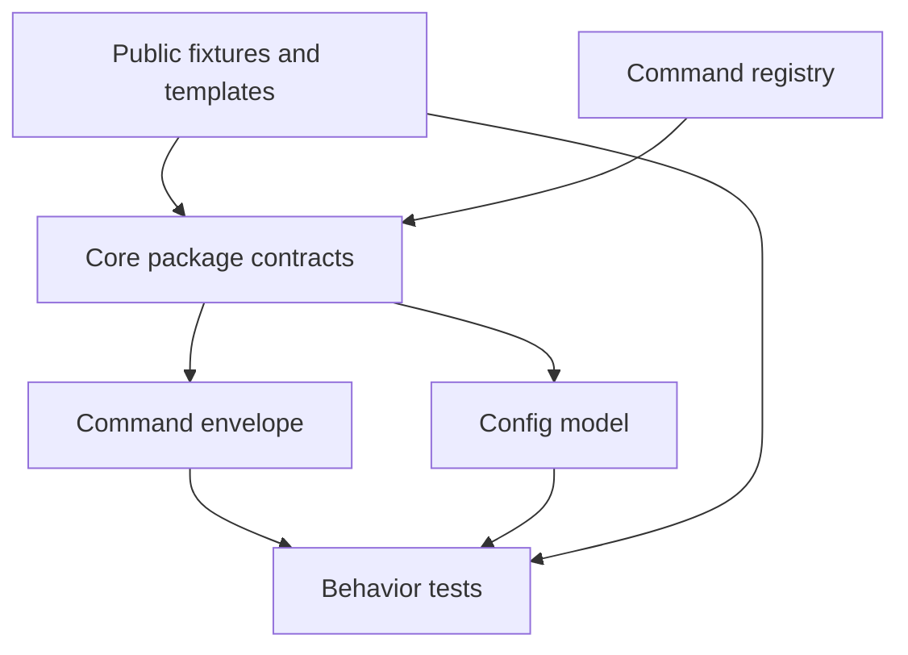

# Bootstrap Core Contracts

## Goal

- Create the first implementation scaffold for `res2jobWorks` as a public-generic Python-first monorepo.
- Establish the shared command envelope, configuration defaults, public fixtures, docs, and behavior-first test harness that every later feature plan will depend on.
- Keep implementation small: no database schema, no UI, no browser automation, and no LLM provider calls yet.

## Starting Point

- Current behavior:
  - The repo has starter docs and `.vault` artifacts only.
  - There is no source tree, package config, dependency lockfile, command registry, or test harness.
- Current files/docs to read first:
  - `AGENTS.md`
  - `README.md`
  - `.vault/PLAN.md`
  - `.vault/research/project-context-2026-06-03.md`
  - `.vault/decisions/foundational-architecture-2026-06-03.md`
  - `/home/gilgames/Vault/02_Areas/Career/Res2JobWorks-Plan.md`

## Non-Goals and Boundaries

- Do not implement SQLite persistence in this plan.
- Do not build TUI, web UI, browser automation, or document generation.
- Do not add private resume, private tracker, or private job-application data.
- Do not call external LLMs or browser tools.
- Ask before changing the locked architecture from the foundational ADR.

## Related Artifacts

- Research:
  - [x] `.vault/research/project-context-2026-06-03.md`
- Decisions:
  - [x] `.vault/decisions/foundational-architecture-2026-06-03.md`
- Solutions:
  - [ ] `.vault/solutions/bootstrap-core-contracts-solution-2026-06-03.md`
- Encounters:
  - [ ] `.vault/encounters/bootstrap-core-contracts-encounter-2026-06-03.md`
- Visual companion:
  - [x] `.vault/visuals/001-roadmap-architecture-2026-06-03.html`
- Goal run:
  - [x] `.vault/goals/goal-mvp-evaluation-tracking-2026-06-03/`

## Success Criteria

- [ ] Monorepo directories exist for `apps/`, `packages/`, `docs/`, `templates/`, `examples/`, and `tests/`.
- [ ] Python project metadata exists with a runnable package layout and development dependencies.
- [ ] Core package exposes a stable command envelope model with `ok`, `command`, `inputs`, `data`, `files`, `warnings`, and `errors`.
- [ ] A starter command registry exists and describes planned command ids without implementing full behavior.
- [ ] Public-generic fixtures exist and contain no private personal data.
- [ ] Focused behavior tests pass for command envelope serialization, config loading, and fixture validation.

## Architecture Diagram



ASCII fallback:

```text
[fixtures/templates] + [registry] -> [core contracts] -> [envelope/config] -> [tests]
```

## ADR Summary

- Decision: Start with a Python-first monorepo and shared command contracts before any feature-heavy implementation.
- Drivers:
  - Later plans need a stable package layout and command envelope.
  - Public fixtures must be safe before import/evaluation tests exist.
  - Generated wrappers depend on command metadata.
- Alternatives considered:
  - Build SQLite first: rejected because command and fixture contracts should guide schema.
  - Build UI first: rejected because UI must stay a client over core truth.
  - Clone `career-ops` structure directly: rejected because this project needs its own public-generic, multi-agent architecture.
- Consequences:
  - This plan produces scaffolding and tests, not visible product workflows.
  - Future implementation has a stable base.
- Promote to `.vault/decisions/`: No, covered by foundational ADR unless a stack choice changes.

## Worktree Session

- Required: Yes
- Recommended command: `bash ~/.agents/skills/core/git-worktree/scripts/worktree-manager.sh create res2jobworks-bootstrap-core --from main`
- Expected worktree name: `res2jobworks-bootstrap-core`
- Branch plan: `codex/bootstrap-core-contracts`
- Review note: Review scaffolding, public fixtures, and tests before plan 002 begins.

## Execution Steps

- [ ] Step 1: Create monorepo skeleton
  - ACTION: Create implementation directories and project metadata.
  - IMPLEMENT: Use the target shape from `.vault/PLAN.md`; keep files small and purpose-specific.
  - FILES: `pyproject.toml`, `packages/core/`, `apps/cli/`, `apps/tui/`, `apps/web/`, `tests/`
  - MIRROR: `.vault/PLAN.md` target monorepo shape.
  - GOTCHA: Do not create UI or persistence implementation yet.
  - VALIDATE: `rg --files`

- [ ] Step 2: Define command envelope and config contracts
  - ACTION: Add Pydantic models for command results and local config defaults.
  - IMPLEMENT: Include JSON serialization, explicit warnings/errors, and no success-shaped defaults for invalid inputs.
  - FILES: `packages/core/src/res2jobworks_core/contracts.py`, `packages/core/src/res2jobworks_core/config.py`
  - MIRROR: Command envelope in `/home/gilgames/Vault/02_Areas/Career/Res2JobWorks-Plan.md`.
  - GOTCHA: Keep provider keys out of config fixtures.
  - VALIDATE: Focused pytest for envelope/config behavior.

- [ ] Step 3: Add starter command registry
  - ACTION: Add registry metadata for MVP command ids.
  - IMPLEMENT: Define command id, description, inputs, outputs, phase, and client support without overbuilding runtime dispatch.
  - FILES: `packages/core/src/res2jobworks_core/registry.py`, `commands/registry.yaml`
  - MIRROR: Planned CLI commands in the Vault plan note.
  - GOTCHA: Registry is the source for wrappers; do not duplicate command lists elsewhere except generated docs.
  - VALIDATE: Registry validation test.

- [ ] Step 4: Add public fixtures and docs
  - ACTION: Create public example persona, profile, and job description fixtures.
  - IMPLEMENT: Use generic fictional examples and label them as fixtures.
  - FILES: `templates/profile-example.yaml`, `examples/jobs/sample-job.md`, `docs/fixtures.md`
  - MIRROR: Public-generic guardrails in `AGENTS.md`.
  - GOTCHA: No private resume, employer, tracker, or application history.
  - VALIDATE: Fixture validation test and `rg` scan for known private markers if any are documented.

- [ ] Step 5: Wire tests and lightweight quality checks
  - ACTION: Add pytest, ruff, and packaging smoke checks.
  - IMPLEMENT: Use behavior-first tests through public package entrypoints.
  - FILES: `tests/`, `pyproject.toml`
  - MIRROR: `~/.agents/skills/core/tdd-tester/SKILL.md`.
  - GOTCHA: Avoid testing private helpers or adding public APIs only for tests.
  - VALIDATE: `pytest -q`, `ruff check .`

## Code Documentation Contract

- [ ] New nontrivial source files include top-level language-native documentation.
- [ ] Public/exported functions, classes, commands, or modules have concise doc comments where their purpose or constraints are not obvious.
- [ ] Comments explain intent, invariants, tradeoffs, or edge cases rather than restating code.

## Testing Strategy (TDD)

### TDD Contract

- [ ] Red: write a failing test first for each behavior change where practical
- [ ] Green: implement the smallest change that passes
- [ ] Refactor: improve structure while keeping tests green

### Test File Plan

- New tests to add:
  - `tests/core/test_command_envelope_should_round_trip_json.py`
  - `tests/core/test_invalid_command_result_should_report_errors.py`
  - `tests/core/test_default_config_should_avoid_private_paths.py`
  - `tests/core/test_registry_entries_should_have_required_metadata.py`
  - `tests/fixtures/test_public_fixtures_should_validate_without_private_data.py`
- Naming convention notes:
  - Use `[condition]-should-[expected-behavior]` labels where the framework permits.
  - Python functions use `test_<condition>_should_<expected_behavior>`.

### Coverage Layers

- [x] Unit tests
- [ ] Integration tests
- [ ] End-to-end workflow tests
- [x] Edge cases and regressions identified

## Execution Lanes

- Implementation lane: `implementer`
- Validation lane: `validator`
- Review lane: `reviewer`
- Security lane: `security` for private-data fixture review
- Pattern lane: `pattern-detector`

## Goal Run Overlay

- Goal run path: `.vault/goals/goal-mvp-evaluation-tracking-2026-06-03/`
- Role in goal run: Primary
- Milestone/task IDs:
  - `M1.T1` Bootstrap monorepo and core contracts
- Dependencies:
  - None
- Current state: ready
- Handoff source: `.vault/goals/goal-mvp-evaluation-tracking-2026-06-03/handoff.md`

## Verification Contract

- Primary commands:
  - `pytest -q`
  - `ruff check .`
  - `python -m res2jobworks_core` or equivalent smoke command once package entrypoint exists
- Required proof of completion:
  - Test output showing envelope, registry, config, and fixture checks pass.
  - `rg --files` showing the expected monorepo shape.
  - No private personal data in public fixtures.
- Review gates:
  - validator pass
  - reviewer approve
  - security pass for fixtures/config
  - pattern-detector pass if registry or contracts drift from plan

## Goal Contract

Use this block as the source for Codex native `/goal` when long-running continuation is useful.

```text
Objective:
Implement the res2jobWorks bootstrap plan by creating the Python-first monorepo skeleton, shared command envelope, config defaults, starter command registry, public fixtures, docs, and behavior-first tests.

Starting point:
Repo has starter docs and planning artifacts only. Plan path: `.vault/plans/001-bootstrap-core-contracts-2026-06-03.md`.

Read first:
- `AGENTS.md`
- `.vault/PLAN.md`
- `.vault/research/project-context-2026-06-03.md`
- `.vault/decisions/foundational-architecture-2026-06-03.md`

Constraints:
- Do not implement SQLite, UI, browser automation, providers, or document generation.
- Do not add private personal data.
- Keep core contracts public, documented, and testable.

Iteration policy:
- Work in small milestones.
- Write behavior tests before production code where practical.
- Run focused verification after each milestone.
- If validation fails, fix and rerun once.
- If the same blocker recurs twice, stop and capture an encounter.

Verification:
- `pytest -q`
- `ruff check .`
- Package smoke command if available
- Fixture privacy review

Stop conditions:
- Success: scaffold, contracts, registry, fixtures, docs, and tests are complete and verified.
- Ask user: architecture boundary change, private data fixture, paid/external service, or major stack pivot.
- Blocker: packaging or environment setup fails twice with the same root cause.

Final evidence:
- Changed artifacts, test commands/results, fixture privacy status, and next plan readiness.
```

## Durable Artifact Capture Rule

- Capture `.vault/decisions/bootstrap-core-contracts-decision-2026-06-03.md` if implementation changes stack, package layout, command envelope, or registry ownership.
- Capture `.vault/solutions/bootstrap-core-contracts-solution-2026-06-03.md` if a reusable scaffold, fixture validation, or registry validation pattern emerges.
- Capture `.vault/encounters/bootstrap-core-contracts-encounter-2026-06-03.md` for recurring setup, packaging, path, or fixture privacy failures.

## Risks and Mitigations

| Risk | Likelihood | Impact | Mitigation |
|------|------------|--------|------------|
| Scaffolding overbuilds future features | Medium | Medium | Keep this plan limited to contracts, registry, fixtures, docs, and tests |
| Private data enters fixtures | Medium | High | Use fictional examples and run fixture privacy review |
| Registry becomes docs-only and not testable | Medium | Medium | Add validation tests and use it as the planned wrapper source |
| Package layout fights future apps | Low | Medium | Keep packages modular and clients thin |

## Open Questions

- [ ] Should `uv` be mandatory in project docs from the first scaffold, or one supported environment path?
- [ ] Should the command registry live at repo root `commands/registry.yaml`, inside `packages/core`, or both with one generated copy?

## Progress Log

- 2026-06-03: Plan created from prior-session context and repo/Vault evidence.
