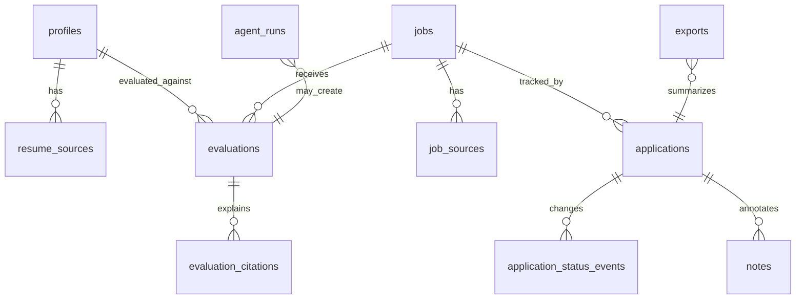

# SQLite Evaluation Tracking Model

## Goal

- Implement the canonical SQLite data model for MVP 1 evaluation and tracking.
- Add migrations, repositories, validation, and tests for profiles, resume sources, jobs, job sources, evaluations, citations, applications, status events, notes, exports, and agent runs.
- Make SQLite the only source of truth; Markdown, CSV, and JSON remain outputs.

## Starting Point

- Current behavior:
  - Plan 001 should have created the monorepo, core package, command envelope, config defaults, registry, fixtures, and test harness.
  - No database schema or persistence layer exists before this plan.
- Current files/docs to read first:
  - `.vault/plans/001-bootstrap-core-contracts-2026-06-03.md`
  - `.vault/decisions/foundational-architecture-2026-06-03.md`
  - `.vault/research/project-context-2026-06-03.md`
  - `packages/core/` after plan 001 lands
  - `commands/registry.yaml` after plan 001 lands

## Non-Goals and Boundaries

- Do not implement full import, evaluation, export, TUI, web UI, browser automation, or document generation.
- Do not make Markdown or CSV writable canonical state.
- Do not store secrets or provider API keys in SQLite.
- Do not add private personal records to fixtures.
- Ask before choosing a DB layer that conflicts with the plan 001 package shape.

## Related Artifacts

- Research:
  - [x] `.vault/research/project-context-2026-06-03.md`
- Decisions:
  - [x] `.vault/decisions/foundational-architecture-2026-06-03.md`
  - [ ] `.vault/decisions/sqlite-data-layer-2026-06-03.md`
- Solutions:
  - [ ] `.vault/solutions/sqlite-repository-pattern-2026-06-03.md`
- Encounters:
  - [ ] `.vault/encounters/sqlite-migration-encounter-2026-06-03.md`
- Visual companion:
  - [x] `.vault/visuals/001-roadmap-architecture-2026-06-03.html`
- Goal run:
  - [x] `.vault/goals/goal-mvp-evaluation-tracking-2026-06-03/`

## Success Criteria

- [ ] A migration system initializes and upgrades a local SQLite workspace deterministically.
- [ ] Schema covers profiles, resume sources, jobs, job sources, evaluations, evaluation citations, applications, application status events, notes, exports, and agent runs.
- [ ] Repository/service APIs enforce explicit validation and do not silently coerce invalid records into success.
- [ ] Status changes are append-only events, not destructive overwrites.
- [ ] Tests prove create/read/update/list behavior and referential integrity for core records.
- [ ] A sample local database can be created from public fixtures without private data.

## Architecture Diagram



ASCII fallback:

```text
profiles -> evaluations <- jobs
jobs -> applications -> status_events
evaluations -> citations
applications -> notes/exports
agent_runs -> evaluations/applications
```

## ADR Summary

- Decision: Use SQLite as canonical local state with a migration-backed persistence layer.
- Drivers:
  - Local-first user data should be inspectable and portable.
  - Evaluation citations and status history need relational integrity.
  - Future clients need stable data contracts.
- Alternatives considered:
  - Flat Markdown/CSV tracker: easy to inspect but weak relational history.
  - JSON files: portable but harder to query and migrate safely.
  - Hosted Postgres: powerful but contradicts local-first MVP.
- Consequences:
  - Migrations and repository tests become required early.
  - Exports must be generated from SQLite, not hand-edited as truth.
- Promote to `.vault/decisions/`: Yes, create data-layer ADR when SQLAlchemy vs SQLModel and migration tooling are chosen.

## Worktree Session

- Required: Yes
- Recommended command: `bash ~/.agents/skills/core/git-worktree/scripts/worktree-manager.sh create res2jobworks-sqlite-model --from main`
- Expected worktree name: `res2jobworks-sqlite-model`
- Branch plan: `codex/sqlite-evaluation-tracking-model`
- Review note: Review schema, migration path, and repository API before workflows depend on them.

## Execution Steps

- [ ] Step 1: Choose and record DB layer
  - ACTION: Decide SQLAlchemy vs SQLModel and migration tooling.
  - IMPLEMENT: Prefer explicit, boring, migration-friendly APIs; record the choice in `.vault/decisions/sqlite-data-layer-2026-06-03.md`.
  - FILES: `pyproject.toml`, `.vault/decisions/sqlite-data-layer-2026-06-03.md`
  - MIRROR: Foundational ADR.
  - GOTCHA: Avoid an ORM layer that hides migrations or makes schema hard to inspect.
  - VALIDATE: Dependency and import smoke test.

- [ ] Step 2: Define schema and migrations
  - ACTION: Add migrations for MVP 1 tables.
  - IMPLEMENT: Include primary keys, foreign keys, timestamps, status enums, rubric/evaluation versions, source references, and export metadata.
  - FILES: `packages/core/src/res2jobworks_core/db/`, `packages/core/migrations/`
  - MIRROR: Data model defaults in the Vault plan note.
  - GOTCHA: Status history should be append-only; do not overwrite historical status events.
  - VALIDATE: Migration create/upgrade test.

- [ ] Step 3: Add repository and unit-of-work contracts
  - ACTION: Create persistence APIs for core aggregates.
  - IMPLEMENT: Keep repository methods explicit and return typed results/errors through core contracts.
  - FILES: `packages/core/src/res2jobworks_core/repositories/`
  - MIRROR: Command envelope error handling from plan 001.
  - GOTCHA: Do not leak ORM internals into client contracts.
  - VALIDATE: Focused repository tests.

- [ ] Step 4: Add fixture-backed seed path
  - ACTION: Let public fixtures initialize a sample workspace database.
  - IMPLEMENT: Use deterministic IDs or stable lookup keys where tests need repeatability.
  - FILES: `packages/core/src/res2jobworks_core/seed.py`, `tests/fixtures/`
  - MIRROR: Public fixture policy from plan 001.
  - GOTCHA: Seed data must remain public-generic.
  - VALIDATE: Fixture seed test.

- [ ] Step 5: Connect registry metadata to persistence readiness
  - ACTION: Mark database-backed commands as planned/available according to implemented persistence.
  - IMPLEMENT: Avoid claiming workflow commands are complete before plan 003.
  - FILES: `commands/registry.yaml`, generated docs if present
  - MIRROR: Registry ownership from plan 001.
  - GOTCHA: Do not duplicate command state in separate docs.
  - VALIDATE: Registry validation test.

## Code Documentation Contract

- [ ] Schema modules include purpose and migration invariants.
- [ ] Repository public methods document side effects and failure modes where signatures are not enough.
- [ ] Comments explain relational constraints, status history, and citation invariants.

## Testing Strategy (TDD)

### TDD Contract

- [ ] Red: write failing tests for migration, schema, and repository behavior before implementation where practical
- [ ] Green: implement minimal persistence behavior
- [ ] Refactor: improve structure while keeping tests green

### Test File Plan

- New tests to add:
  - `tests/db/test_empty_workspace_should_apply_all_migrations.py`
  - `tests/db/test_profile_with_resume_source_should_persist_and_reload.py`
  - `tests/db/test_job_with_source_should_persist_and_reload.py`
  - `tests/db/test_evaluation_should_require_citations.py`
  - `tests/db/test_application_status_update_should_append_event.py`
  - `tests/db/test_exports_should_reference_canonical_records.py`
  - `tests/db/test_fixture_seed_should_create_public_sample_workspace.py`
- Naming convention notes:
  - Use `[condition]-should-[expected-behavior]` labels and Python `test_<condition>_should_<expected_behavior>` functions.

### Coverage Layers

- [x] Unit tests
- [x] Integration tests
- [ ] End-to-end workflow tests
- [x] Edge cases and regressions identified

## Execution Lanes

- Implementation lane: `implementer`
- Validation lane: `validator`
- Review lane: `reviewer`
- Security lane: `security` for data/privacy review
- Pattern lane: `pattern-detector`

## Goal Run Overlay

- Goal run path: `.vault/goals/goal-mvp-evaluation-tracking-2026-06-03/`
- Role in goal run: Primary
- Milestone/task IDs:
  - `M2.T1` Build SQLite source of truth
- Dependencies:
  - `M2.T1` depends on `M1.T1`
- Current state: planned
- Handoff source: `.vault/goals/goal-mvp-evaluation-tracking-2026-06-03/handoff.md`

## Verification Contract

- Primary commands:
  - `pytest -q tests/db`
  - `pytest -q`
  - `ruff check .`
- Required proof of completion:
  - Migration tests pass from an empty database.
  - Repository tests pass for every MVP 1 aggregate.
  - Sample fixture database can be created and inspected.
- Review gates:
  - validator pass
  - reviewer approve
  - security pass for data/privacy boundaries

## Goal Contract

```text
Objective:
Implement the SQLite evaluation/tracking model for res2jobWorks with migrations, repositories, validation, fixture seeding, and tests.

Starting point:
Plan 001 foundation should exist. Plan path: `.vault/plans/002-sqlite-evaluation-tracking-model-2026-06-03.md`.

Read first:
- `.vault/plans/001-bootstrap-core-contracts-2026-06-03.md`
- `.vault/decisions/foundational-architecture-2026-06-03.md`
- `commands/registry.yaml`
- `packages/core/`

Constraints:
- SQLite is canonical.
- Markdown/CSV/JSON are outputs only.
- No secrets or private personal fixtures.
- Do not implement UI, browser automation, provider calls, or document generation.

Iteration policy:
- Choose DB layer and record the decision.
- Add failing migration/repository tests before implementation where practical.
- Verify after each aggregate.
- Stop and capture an encounter if migration setup fails twice for the same cause.

Verification:
- `pytest -q tests/db`
- `pytest -q`
- `ruff check .`

Stop conditions:
- Success: all MVP tables, migrations, repositories, and fixture seed checks are implemented and verified.
- Ask user: schema scope expansion, hosted database, private data, or DB layer pivot.
- Blocker: repeated migration/tooling failure with no clear local fix.

Final evidence:
- Schema/migration summary, test outputs, data-layer ADR path, and plan 003 readiness.
```

## Durable Artifact Capture Rule

- Capture `.vault/decisions/sqlite-data-layer-2026-06-03.md` for DB layer and migration tooling.
- Capture `.vault/solutions/sqlite-repository-pattern-2026-06-03.md` if repository/unit-of-work conventions become reusable.
- Capture `.vault/encounters/sqlite-migration-encounter-2026-06-03.md` for migration setup failures or integrity surprises.

## Risks and Mitigations

| Risk | Likelihood | Impact | Mitigation |
|------|------------|--------|------------|
| Schema overfits phase 2 too early | Medium | Medium | Include phase 2 extension points but implement MVP 1 fields only |
| Status history is overwritten | Low | High | Model status as append-only events and test it |
| Exports become canonical | Medium | High | Keep export records as generated artifacts pointing back to SQLite |
| ORM internals leak to clients | Medium | Medium | Keep repository and command contracts typed and explicit |

## Open Questions

- [ ] SQLAlchemy or SQLModel?
- [ ] Alembic-style migrations or a lighter explicit migration runner?
- [ ] Should evaluation citations require exact text spans in MVP 1, or allow source-level citations first?

## Progress Log

- 2026-06-03: Plan created from roadmap and foundational ADR.
