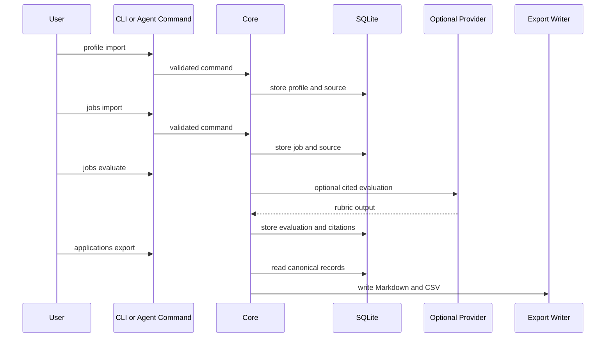

# Import, Evaluate, Export Workflows

## Goal

- Implement MVP 1 workflows for importing profiles and jobs, evaluating jobs against profiles, storing cited evaluation records, updating application tracking state, and exporting Markdown/CSV reports from SQLite.
- Keep evaluation evidence-centered, reversible, and clearly labeled when LLM-backed output is used.
- Provide command-envelope results that clients and agents can call consistently.

## Starting Point

- Current behavior:
  - Plan 001 should provide command contracts, registry, fixtures, and tests.
  - Plan 002 should provide SQLite persistence and repository APIs.
  - No complete user workflow exists before this plan.
- Current files/docs to read first:
  - `.vault/plans/001-bootstrap-core-contracts-2026-06-03.md`
  - `.vault/plans/002-sqlite-evaluation-tracking-model-2026-06-03.md`
  - `.vault/decisions/foundational-architecture-2026-06-03.md`
  - `commands/registry.yaml`
  - `packages/core/`
  - `templates/` and `examples/`

## Non-Goals and Boundaries

- Do not build TUI/web UI beyond command support.
- Do not implement browser extraction unless explicitly scoped as safe URL/text fetch inside this plan; Playwright automation belongs to plan 005.
- Do not generate resumes, cover letters, or PDFs.
- Do not auto-submit applications.
- Do not hide LLM use; evaluation records must label provider/rubric/version/citations where applicable.

## Related Artifacts

- Research:
  - [x] `.vault/research/project-context-2026-06-03.md`
- Decisions:
  - [x] `.vault/decisions/foundational-architecture-2026-06-03.md`
  - [x] `.vault/decisions/evaluation-strategy-2026-06-03.md`
- Solutions:
  - [x] `.vault/solutions/cited-evaluation-workflow-2026-06-03.md`
- Encounters:
  - [ ] `.vault/encounters/evaluation-provider-encounter-2026-06-03.md`
- Visual companion:
  - [x] `.vault/visuals/001-roadmap-architecture-2026-06-03.html`
- Goal run:
  - [x] `.vault/goals/goal-mvp-evaluation-tracking-2026-06-03/`

## Success Criteria

- [x] Users can initialize a workspace and import a public-generic profile/resume source.
- [x] Users can import a job description from text/file into SQLite.
- [x] Evaluation creates a score, rubric breakdown, recommendations, warnings, and citations tied to stored profile/job sources.
- [x] LLM-backed evaluation, if included, stores provider metadata, prompt/rubric version, and inspectable citations.
- [x] Application records can be created and status events updated through command workflows.
- [x] Markdown and CSV exports are generated from SQLite and recorded in export metadata.
- [x] Behavior tests cover successful workflows, validation failures, and reversible evaluation records.

## Architecture Diagram



ASCII fallback:

```text
profile/job import -> SQLite -> evaluate with rubric/citations -> SQLite -> Markdown/CSV export
```

## ADR Summary

- Decision: Build deterministic import/tracking/export first, then add LLM-backed rubric evaluation as cited and reversible behavior.
- Drivers:
  - Users need trustable records and clear evidence.
  - LLM output must not become opaque product truth.
  - Exports need to be generated artifacts from SQLite.
- Alternatives considered:
  - LLM-first freeform evaluation: fast but hard to inspect.
  - Deterministic-only scoring: reliable but may miss qualitative fit and nuance.
  - Export-only tracker: easy but conflicts with SQLite source of truth.
- Consequences:
  - Evaluation strategy should be recorded in an ADR.
  - Provider adapters must be optional and testable without live credentials.
- Promote to `.vault/decisions/`: Yes, create evaluation strategy ADR.

## Worktree Session

- Required: Yes
- Recommended command: `bash ~/.agents/skills/core/git-worktree/scripts/worktree-manager.sh create res2jobworks-import-evaluate-export --from main`
- Expected worktree name: `res2jobworks-import-evaluate-export`
- Branch plan: `codex/import-evaluate-export`
- Review note: Review workflow behavior, citation quality, and export semantics before UI clients begin.

## Execution Steps

- [x] Step 1: Implement workspace/profile import commands
  - ACTION: Add command handlers for workspace init and profile import.
  - IMPLEMENT: Validate files/text, preserve source metadata, and return command envelopes.
  - FILES: `packages/core/src/res2jobworks_core/commands/`, `commands/registry.yaml`, `tests/workflows/`
  - MIRROR: Plan 001 command envelope.
  - GOTCHA: Do not store private fixture data in repo.
  - VALIDATE: Focused import tests.

- [x] Step 2: Implement job import and validation
  - ACTION: Add text/file job import into SQLite.
  - IMPLEMENT: Store original source, normalized text, source type, and validation warnings.
  - FILES: `packages/core/src/res2jobworks_core/jobs/`, `tests/workflows/`
  - MIRROR: Persistence contracts from plan 002.
  - GOTCHA: URL/browser extraction belongs to later scope unless explicitly accepted.
  - VALIDATE: Job import tests.

- [x] Step 3: Implement evaluation strategy
  - ACTION: Choose deterministic, LLM-rubric-first, or hybrid starter strategy and record ADR.
  - IMPLEMENT: Store rubric version, score dimensions, citations, warnings, and provider metadata where used.
  - FILES: `packages/core/src/res2jobworks_core/evaluation/`, `.vault/decisions/evaluation-strategy-2026-06-03.md`
  - MIRROR: LLM guardrails in `AGENTS.md`.
  - GOTCHA: No opaque evaluation records; no live provider calls in default tests.
  - VALIDATE: Evaluation tests with fixture/provider fakes.

- [x] Step 4: Implement application tracking workflow
  - ACTION: Add application create/update/list behavior over jobs and evaluations.
  - IMPLEMENT: Use append-only status events and notes.
  - FILES: `packages/core/src/res2jobworks_core/applications/`, `tests/workflows/`
  - MIRROR: Plan 002 status model.
  - GOTCHA: Do not overwrite status history.
  - VALIDATE: Status event tests.

- [x] Step 5: Implement Markdown/CSV exports
  - ACTION: Export evaluation reports and tracker summaries from SQLite.
  - IMPLEMENT: Record export metadata and output file paths in command envelopes.
  - FILES: `packages/core/src/res2jobworks_core/exports/`, `docs/exports.md`
  - MIRROR: Export-as-artifact rule.
  - GOTCHA: Exports are derived; edits to exports should not mutate SQLite.
  - VALIDATE: Snapshot or structural export tests.

## Code Documentation Contract

- [x] Workflow modules document command boundaries and side effects.
- [x] Evaluation public APIs document provider use, citation expectations, and reversibility constraints.
- [x] Export modules document generated-file behavior and canonical-state boundaries.

## Testing Strategy (TDD)

### TDD Contract

- [x] Red: write workflow-level tests through command handlers first
- [x] Green: implement the smallest behavior that satisfies each workflow
- [x] Refactor: extract service modules after workflows are green

### Test File Plan

- New tests to add:
  - `tests/workflows/test_workspace_init_should_create_sqlite_workspace.py`
  - `tests/workflows/test_profile_import_should_store_source_and_summary.py`
  - `tests/workflows/test_job_import_should_store_original_description.py`
  - `tests/workflows/test_job_evaluation_should_store_rubric_citations.py`
  - `tests/workflows/test_application_update_should_preserve_status_history.py`
  - `tests/workflows/test_markdown_export_should_be_generated_from_sqlite.py`
  - `tests/workflows/test_csv_export_should_include_tracker_rows.py`
- Naming convention notes:
  - Use behavior labels from `~/.agents/skills/core/tdd-tester/SKILL.md`.

### Coverage Layers

- [x] Unit tests
- [x] Integration tests
- [x] End-to-end or workflow tests
- [x] Edge cases and regressions identified

## Execution Lanes

- Implementation lane: `implementer`
- Validation lane: `validator`
- Review lane: `reviewer`
- Security lane: `security` for provider/data handling
- Pattern lane: `pattern-detector`

## Goal Run Overlay

- Goal run path: `.vault/goals/goal-mvp-evaluation-tracking-2026-06-03/`
- Role in goal run: Primary
- Milestone/task IDs:
  - `M3.T1` Implement import/evaluate/export workflows
- Dependencies:
  - `M3.T1` depends on `M2.T1`
- Current state: complete
- Handoff source: `.vault/goals/goal-mvp-evaluation-tracking-2026-06-03/handoff.md`

## Verification Contract

- Primary commands:
  - `pytest -q tests/workflows`
  - `pytest -q`
  - `ruff check .`
- Required proof of completion:
  - Public fixture workflow completes from init to export.
  - Evaluation records include citations and rubric/version metadata.
  - Export files are generated and tracked as outputs.
- Review gates:
  - validator pass
  - reviewer approve
  - security pass if providers or prompt/response storage are involved

## Goal Contract

```text
Objective:
Implement res2jobWorks MVP import, evaluation, application tracking, and Markdown/CSV export workflows over the SQLite core.

Starting point:
Plans 001 and 002 should be complete. Plan path: `.vault/plans/003-import-evaluate-export-workflows-2026-06-03.md`.

Read first:
- `.vault/plans/001-bootstrap-core-contracts-2026-06-03.md`
- `.vault/plans/002-sqlite-evaluation-tracking-model-2026-06-03.md`
- `.vault/decisions/foundational-architecture-2026-06-03.md`
- `commands/registry.yaml`

Constraints:
- SQLite remains canonical.
- Exports are generated artifacts.
- LLM output must be labeled, cited, reversible, and testable without live credentials.
- No UI, browser automation, document generation, or auto-submit behavior.

Iteration policy:
- Implement one workflow at a time through behavior tests.
- Use provider fakes for tests.
- Update registry metadata as commands become real.
- Capture evaluation strategy as an ADR.

Verification:
- `pytest -q tests/workflows`
- `pytest -q`
- `ruff check .`

Stop conditions:
- Success: public fixture workflow imports, evaluates, tracks, and exports with verified citations.
- Ask user: live provider requirement, URL/browser import scope, private dogfooding data, or scoring strategy pivot.
- Blocker: provider/evaluation design cannot produce inspectable citations.

Final evidence:
- Workflow summary, generated sample outputs, test results, evaluation ADR path, and plan 004 readiness.
```

## Durable Artifact Capture Rule

- Capture `.vault/decisions/evaluation-strategy-2026-06-03.md` for the scoring/evaluation approach.
- Capture `.vault/solutions/cited-evaluation-workflow-2026-06-03.md` if citation storage or provider fakes become reusable patterns.
- Capture `.vault/encounters/evaluation-provider-encounter-2026-06-03.md` for provider, citation, or export blockers.

## Risks and Mitigations

| Risk | Likelihood | Impact | Mitigation |
|------|------------|--------|------------|
| Evaluation lacks trustworthy citations | Medium | High | Store source links/spans and require tests for citation presence |
| Provider tests become credential-dependent | Medium | High | Use fakes and mark live-provider checks optional |
| Export format becomes product truth | Medium | High | Test that exports are generated from SQLite |
| Workflow scope expands into tailoring | Medium | Medium | Keep tailoring in plan 006 |

## Open Questions

- [x] Should MVP evaluation be deterministic-first, LLM-rubric-first, or hybrid? Resolved: deterministic-first for MVP 1, with later LLM adapters behind the same cited record shape.
- [x] What minimum citation granularity is required for MVP: source-only, paragraph, or span? Resolved: source-bound quotes are required; exact offsets remain optional.
- [x] Should safe URL fetch be included here or deferred entirely to plan 005? Resolved: defer URL/browser fetching to plan 005.

## Progress Log

- 2026-06-03: Plan created from roadmap and foundational ADR.
- 2026-06-04: Implemented modular command workflows for workspace init, profile/job import, deterministic cited evaluation, application add/update/list, and Markdown/CSV tracker exports. Registry statuses now mark only implemented command handlers as `available`.
- 2026-06-04: Captured deterministic-first evaluation strategy in `.vault/decisions/evaluation-strategy-2026-06-03.md` and reusable citation/export pattern in `.vault/solutions/cited-evaluation-workflow-2026-06-03.md`.
- 2026-06-04: Local verification passed with `uv run --extra dev pytest -q tests/workflows` (`14 passed`), `uv run --extra dev pytest -q` (`58 passed`), `uv run --extra dev ruff check .`, `uv build`, `git diff --check`, and a fresh installed-wheel workflow smoke from `/tmp`.
- 2026-06-04: Reviewer blockers for registry/handler `rubric_id` mismatch and duplicate deterministic IDs escaping as raw SQLite exceptions were fixed with command-envelope regression tests for duplicate profile imports, evaluations, applications, and exports.
