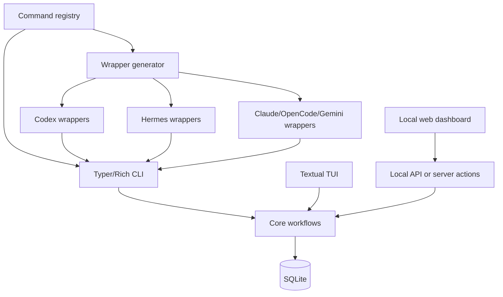

# Interfaces and Agent Wrappers

## Goal

- Build the first usable clients over the shared core workflows: CLI, TUI, local web dashboard, and generated agent wrappers.
- Keep all clients thin over the same command registry, command envelope, SQLite-backed core, and workflow contracts.
- Verify CLI, TUI, web dashboard, and generated wrappers expose equivalent MVP behavior without duplicating product logic.

## Starting Point

- Current behavior:
  - Plans 001-003 should provide core contracts, persistence, import/evaluation/export workflows, and registry metadata.
  - No user-facing app or wrapper generator exists before this plan.
- Current files/docs to read first:
  - `.vault/plans/001-bootstrap-core-contracts-2026-06-03.md`
  - `.vault/plans/002-sqlite-evaluation-tracking-model-2026-06-03.md`
  - `.vault/plans/003-import-evaluate-export-workflows-2026-06-03.md`
  - `commands/registry.yaml`
  - `packages/core/`
  - `apps/`

## Non-Goals and Boundaries

- Do not add new product truth outside core workflows.
- Do not implement browser automation or document generation.
- Do not build a marketing landing page; web should start as the local dashboard/tool surface.
- Do not require a public SaaS backend.
- Do not create hand-written agent wrappers that drift from registry metadata.

## Related Artifacts

- Research:
  - [x] `.vault/research/project-context-2026-06-03.md`
- Decisions:
  - [x] `.vault/decisions/foundational-architecture-2026-06-03.md`
  - [ ] `.vault/decisions/local-web-dashboard-stack-2026-06-03.md`
- Solutions:
  - [ ] `.vault/solutions/command-wrapper-generation-2026-06-03.md`
- Encounters:
  - [ ] `.vault/encounters/client-parity-encounter-2026-06-03.md`
- Visual companion:
  - [x] `.vault/visuals/001-roadmap-architecture-2026-06-03.html`
- Goal run:
  - [x] `.vault/goals/goal-mvp-evaluation-tracking-2026-06-03/`

## Success Criteria

- [ ] CLI commands cover workspace init, profile import/show, job import/evaluate/list/show, application add/update/list/export, and wrapper generation.
- [ ] TUI exposes the MVP job queue, filters, detail preview, evaluation citations, status updates, and export actions.
- [ ] Local web dashboard exposes equivalent MVP workflows through the same core/backend contracts.
- [ ] Agent wrapper generation produces Codex/Hermes/Claude/OpenCode/Gemini-ready artifacts or documented stubs from the shared command registry.
- [ ] Client parity tests prove the same core command returns equivalent envelopes across CLI and wrapper paths.
- [ ] UI verification covers keyboard navigation, responsive layout for web, and accessibility basics.

## Architecture Diagram



ASCII fallback:

```text
[registry] -> [CLI + wrapper generator]
[TUI/Web/API/Generated wrappers] -> [core workflows] -> [SQLite]
```

## ADR Summary

- Decision: Build clients as thin surfaces over core workflows and generate agent wrappers from registry metadata.
- Drivers:
  - TUI, web, and agents must stay behaviorally equivalent.
  - Wrappers should not duplicate product logic.
  - Users need a usable local tool, not only library APIs.
- Alternatives considered:
  - Web-first implementation: risks drifting from CLI/agent workflows.
  - Separate wrapper prompts per agent: easy initially but unmaintainable.
  - TUI-only MVP: useful locally but misses browser dashboard requirement.
- Consequences:
  - Registry schema must be good enough for generation.
  - Client parity tests become part of the quality gate.
- Promote to `.vault/decisions/`: Yes, record web dashboard stack and wrapper generation format.

## Worktree Session

- Required: Yes
- Recommended command: `bash ~/.agents/skills/core/git-worktree/scripts/worktree-manager.sh create res2jobworks-interfaces-wrappers --from main`
- Expected worktree name: `res2jobworks-interfaces-wrappers`
- Branch plan: `codex/interfaces-and-agent-wrappers`
- Review note: Review parity across clients and wrapper generation before adding automation.

## Execution Steps

- [ ] Step 1: Implement CLI surface
  - ACTION: Add Typer/Rich CLI commands over core workflows.
  - IMPLEMENT: Return human-readable output by default and machine-readable JSON with a flag.
  - FILES: `apps/cli/`, `packages/core/`, `commands/registry.yaml`
  - MIRROR: Planned CLI commands in Vault plan note.
  - GOTCHA: CLI must call core command handlers, not duplicate workflow logic.
  - VALIDATE: CLI smoke and JSON envelope tests.

- [ ] Step 2: Implement TUI dashboard
  - ACTION: Add Textual app for job queue, filters, detail preview, citations, status updates, and exports.
  - IMPLEMENT: Keep dense, work-focused operational UI; use core services for all mutations.
  - FILES: `apps/tui/`, `tests/tui/`
  - MIRROR: TUI workflow in Obsidian plan.
  - GOTCHA: Do not fork domain behavior into UI state.
  - VALIDATE: Textual smoke tests and command-backed state tests.

- [ ] Step 3: Choose and implement local web dashboard stack
  - ACTION: Decide FastAPI templates vs React/Vite vs SvelteKit or another local approach.
  - IMPLEMENT: Record ADR and build MVP board/table, detail view, citation viewer, timeline, settings/rubric view.
  - FILES: `apps/web/`, `.vault/decisions/local-web-dashboard-stack-2026-06-03.md`
  - MIRROR: Frontend guidance and operational-tool UI expectations.
  - GOTCHA: Do not build a landing page as the first screen.
  - VALIDATE: Browser verification for layout, interactions, responsiveness, and accessibility basics.

- [ ] Step 4: Implement wrapper generator
  - ACTION: Generate agent wrapper files from registry metadata.
  - IMPLEMENT: Include Codex and Hermes first; add Claude/OpenCode/Gemini stubs where formats are unstable.
  - FILES: `packages/skills/`, `docs/agent-wrappers.md`, generated wrapper directories
  - MIRROR: Shared registry rule in `AGENTS.md`.
  - GOTCHA: Generated wrappers should call CLI/API contracts, not embed product logic.
  - VALIDATE: Generator snapshot tests and wrapper smoke checks.

- [ ] Step 5: Add client parity verification
  - ACTION: Test that CLI, TUI/web backend, and wrapper paths produce equivalent command envelopes for MVP commands.
  - IMPLEMENT: Use public fixture workspace.
  - FILES: `tests/parity/`
  - MIRROR: Core-owned truth guardrail.
  - GOTCHA: Avoid brittle full-UI snapshots where command envelope tests are enough.
  - VALIDATE: `pytest -q tests/parity`

## Code Documentation Contract

- [ ] CLI commands document side effects and JSON output mode.
- [ ] TUI/web entrypoints document that core owns mutations.
- [ ] Wrapper generator documents registry ownership and generated-file boundaries.

## Testing Strategy (TDD)

### TDD Contract

- [ ] Red: write CLI/wrapper parity tests before implementation where practical
- [ ] Green: implement client commands by calling core workflows
- [ ] Refactor: improve UI and generator structure while keeping parity tests green

### Test File Plan

- New tests to add:
  - `tests/cli/test_profile_import_command_should_return_command_envelope.py`
  - `tests/cli/test_job_evaluate_command_should_print_json_when_requested.py`
  - `tests/tui/test_job_queue_screen_should_load_public_fixture_workspace.py`
  - `tests/web/test_dashboard_should_show_jobs_and_evaluation_status.py`
  - `tests/wrappers/test_generated_codex_wrapper_should_call_registry_command.py`
  - `tests/parity/test_cli_and_wrapper_should_return_equivalent_envelopes.py`
- Naming convention notes:
  - Use behavior labels from `~/.agents/skills/core/tdd-tester/SKILL.md`.

### Coverage Layers

- [x] Unit tests
- [x] Integration tests
- [x] End-to-end or workflow tests
- [x] Edge cases and regressions identified

## Execution Lanes

- Implementation lane: `implementer`
- Validation lane: `validator`
- Review lane: `reviewer`
- Security lane: `security` for command execution and wrapper safety
- Pattern lane: `pattern-detector`
- Design lane: `design-iterator` for UI polish
- Accessibility lane: `accessibility-auditor` for web/TUI accessibility checks

## Goal Run Overlay

- Goal run path: `.vault/goals/goal-mvp-evaluation-tracking-2026-06-03/`
- Role in goal run: Primary
- Milestone/task IDs:
  - `M4.T1` Build interfaces and generated wrappers
- Dependencies:
  - `M4.T1` depends on `M3.T1`
- Current state: planned
- Handoff source: `.vault/goals/goal-mvp-evaluation-tracking-2026-06-03/handoff.md`

## Verification Contract

- Primary commands:
  - `pytest -q tests/cli tests/wrappers tests/parity`
  - `pytest -q`
  - `ruff check .`
  - Browser verification for web dashboard if implemented with a dev server
- Required proof of completion:
  - CLI can run public fixture workflow.
  - TUI and web can display and mutate the same stored records.
  - Generated wrappers call shared commands and pass parity tests.
  - Web dashboard screenshots or browser notes show responsive, non-overlapping UI.
- Review gates:
  - validator pass
  - reviewer approve
  - security pass for command/wrapper boundaries
  - accessibility-auditor pass for web UI

## Goal Contract

```text
Objective:
Implement res2jobWorks MVP clients and generated agent wrappers over the shared core workflows and command registry.

Starting point:
Plans 001-003 should be complete. Plan path: `.vault/plans/004-interfaces-and-agent-wrappers-2026-06-03.md`.

Read first:
- `.vault/plans/001-bootstrap-core-contracts-2026-06-03.md`
- `.vault/plans/002-sqlite-evaluation-tracking-model-2026-06-03.md`
- `.vault/plans/003-import-evaluate-export-workflows-2026-06-03.md`
- `commands/registry.yaml`

Constraints:
- Clients must call core workflows.
- No duplicated product truth in UI or wrappers.
- Web dashboard is a local tool surface, not a marketing page.
- No browser automation, document generation, or default auto-submit behavior.

Iteration policy:
- Build CLI first, then TUI/web, then wrapper generation, then parity tests.
- Verify each surface against public fixture data.
- Record web stack and wrapper decisions.

Verification:
- `pytest -q tests/cli tests/wrappers tests/parity`
- `pytest -q`
- `ruff check .`
- Browser/accessibility checks for web UI

Stop conditions:
- Success: CLI, TUI, web dashboard, and generated wrappers expose equivalent MVP behavior.
- Ask user: web stack pivot, unsupported agent wrapper format, public deployment, or UI scope expansion.
- Blocker: client parity cannot be preserved through registry/core contracts.

Final evidence:
- Client summary, wrapper output paths, parity test results, browser verification notes, and plan 005 readiness.
```

## Durable Artifact Capture Rule

- Capture `.vault/decisions/local-web-dashboard-stack-2026-06-03.md` for web stack choice.
- Capture `.vault/solutions/command-wrapper-generation-2026-06-03.md` if generation patterns become reusable.
- Capture `.vault/encounters/client-parity-encounter-2026-06-03.md` if clients drift or wrapper formats block parity.

## Risks and Mitigations

| Risk | Likelihood | Impact | Mitigation |
|------|------------|--------|------------|
| Client behavior drifts | Medium | High | Add parity tests against command envelopes |
| UI becomes marketing instead of tool | Medium | Medium | Start web dashboard on operational board/table view |
| Agent wrapper formats are unstable | Medium | Medium | Generate documented stubs where native formats are uncertain |
| Web stack overcomplicates local-first use | Medium | Medium | Record ADR and prefer simple local operation |

## Open Questions

- [ ] Which web dashboard stack should be chosen for MVP?
- [ ] Which agent wrapper should be first-class in generated output after Codex and Hermes?
- [ ] Should wrapper generation produce checked-in files, generated-on-demand files, or both?

## Progress Log

- 2026-06-03: Plan created from roadmap and foundational ADR.
