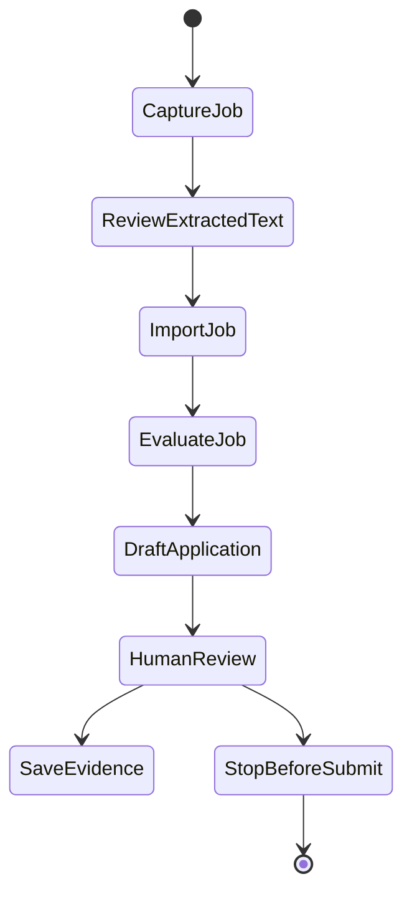

# Browser Automation With Human Review

## Goal

- Add safe browser-assisted workflows for job-source capture, draft/fill/review support, and evidence capture.
- Preserve the product boundary that default behavior never auto-submits job applications.
- Keep browser automation as a client over core contracts, not a separate data store or product brain.

## Starting Point

- Current behavior:
  - Plans 001-004 should provide core workflows, SQLite state, CLI/TUI/web clients, and agent wrappers.
  - Manual profile/job import and evaluation should already work.
  - No browser automation exists before this plan.
- Current files/docs to read first:
  - `.vault/plans/003-import-evaluate-export-workflows-2026-06-03.md`
  - `.vault/plans/004-interfaces-and-agent-wrappers-2026-06-03.md`
  - `.vault/decisions/foundational-architecture-2026-06-03.md`
  - `packages/core/`
  - `packages/automation/` if created

## Non-Goals and Boundaries

- Do not auto-submit applications by default.
- Do not store credentials or session cookies in the repo.
- Do not bypass site terms, paywalls, CAPTCHAs, or explicit user review.
- Do not make browser extraction the only import path.
- Do not implement resume tailoring or document generation.

## Related Artifacts

- Research:
  - [x] `.vault/research/project-context-2026-06-03.md`
- Decisions:
  - [x] `.vault/decisions/foundational-architecture-2026-06-03.md`
  - [ ] `.vault/decisions/browser-automation-safety-boundary-2026-06-03.md`
- Solutions:
  - [ ] `.vault/solutions/browser-evidence-capture-2026-06-03.md`
- Encounters:
  - [ ] `.vault/encounters/browser-automation-encounter-2026-06-03.md`
- Visual companion:
  - [x] `.vault/visuals/001-roadmap-architecture-2026-06-03.html`
- Goal run:
  - [x] `.vault/goals/goal-mvp-evaluation-tracking-2026-06-03/`

## Success Criteria

- [ ] Browser automation can extract a job description into the same job import workflow used by manual text/file imports.
- [ ] Evidence capture stores source URL, captured text, timestamp, and optional screenshot/path metadata without becoming canonical outside SQLite.
- [ ] Draft/fill/review assistance can prepare application fields for user review without submitting.
- [ ] Commands and UI copy clearly label automation state and required human action.
- [ ] Tests cover extraction adapters, blocked submission behavior, and audit records.
- [ ] Security review confirms no credential/session data is checked in or logged unsafely.

## Architecture Diagram



ASCII fallback:

```text
capture -> review extracted text -> import -> evaluate -> draft/fill -> human review -> stop before submit
```

## ADR Summary

- Decision: Browser automation supports extraction, draft, fill, review, and evidence capture only by default.
- Drivers:
  - The prior session and AGENTS guardrails explicitly forbid default auto-submit behavior.
  - Automation should reduce copying effort while preserving user control.
  - Evidence capture makes later evaluation/tracking inspectable.
- Alternatives considered:
  - Full autonomous apply flow: high leverage but unacceptable as default.
  - No browser automation: simpler but misses a core project aspiration.
  - Browser automation as separate product state: would split truth from core.
- Consequences:
  - Automation needs explicit safety gates and tests.
  - UI/CLI wording must distinguish draft/fill/review from submission.
- Promote to `.vault/decisions/`: Yes, create browser safety ADR.

## Worktree Session

- Required: Yes
- Recommended command: `bash ~/.agents/skills/core/git-worktree/scripts/worktree-manager.sh create res2jobworks-browser-automation --from main`
- Expected worktree name: `res2jobworks-browser-automation`
- Branch plan: `codex/browser-automation-human-review`
- Review note: Review safety boundary and captured evidence before expanding automation.

## Execution Steps

- [ ] Step 1: Record browser automation safety boundary
  - ACTION: Create ADR for allowed and disallowed automation behaviors.
  - IMPLEMENT: Name explicit user approval requirements and stop conditions.
  - FILES: `.vault/decisions/browser-automation-safety-boundary-2026-06-03.md`
  - MIRROR: No-auto-submit guardrail.
  - GOTCHA: Do not leave submission behavior ambiguous.
  - VALIDATE: ADR review.

- [ ] Step 2: Implement extraction adapter contracts
  - ACTION: Add browser/source extraction interfaces and test fakes.
  - IMPLEMENT: Return captured text and metadata through command envelopes.
  - FILES: `packages/automation/`, `packages/core/src/res2jobworks_core/job_sources/`, `tests/automation/`
  - MIRROR: Manual job import workflow.
  - GOTCHA: Browser adapter should feed core import, not bypass it.
  - VALIDATE: Extraction adapter tests.

- [ ] Step 3: Add evidence capture records
  - ACTION: Persist source metadata and optional artifact paths.
  - IMPLEMENT: Store URL, capture timestamp, normalized text, and screenshot/file references where applicable.
  - FILES: `packages/core/`, migrations if schema needs extension
  - MIRROR: SQLite canonical state from plan 002.
  - GOTCHA: Do not store secrets, cookies, or raw credential fields.
  - VALIDATE: Evidence persistence tests.

- [ ] Step 4: Add draft/fill/review commands
  - ACTION: Generate application field drafts and prepare browser fill actions for review.
  - IMPLEMENT: Require explicit user review state before any external action.
  - FILES: `packages/automation/`, `commands/registry.yaml`, `apps/cli/`
  - MIRROR: Application tracking workflow.
  - GOTCHA: No submit command in default product path.
  - VALIDATE: Tests prove submit is blocked/unavailable by default.

- [ ] Step 5: Add UI and documentation signals
  - ACTION: Show automation state, source evidence, and review requirements in CLI/TUI/web.
  - IMPLEMENT: Keep wording operational and explicit.
  - FILES: `apps/cli/`, `apps/tui/`, `apps/web/`, `docs/browser-automation.md`
  - MIRROR: Client parity from plan 004.
  - GOTCHA: Avoid text that implies automation completed an application.
  - VALIDATE: UI/browser checks and docs review.

## Code Documentation Contract

- [ ] Automation modules document safety boundaries and side effects.
- [ ] Public automation commands document what they do not do.
- [ ] Comments explain edge cases involving credentials, sessions, blocked submissions, or source evidence.

## Testing Strategy (TDD)

### TDD Contract

- [ ] Red: write safety and extraction tests first
- [ ] Green: implement minimal extraction/evidence behavior
- [ ] Refactor: improve adapter boundaries while safety tests stay green

### Test File Plan

- New tests to add:
  - `tests/automation/test_browser_capture_should_import_job_through_core_workflow.py`
  - `tests/automation/test_evidence_capture_should_store_source_metadata.py`
  - `tests/automation/test_default_automation_should_not_submit_application.py`
  - `tests/automation/test_fill_draft_should_require_human_review_state.py`
  - `tests/security/test_browser_logs_should_not_include_credentials.py`
- Naming convention notes:
  - Use behavior labels from `~/.agents/skills/core/tdd-tester/SKILL.md`.

### Coverage Layers

- [x] Unit tests
- [x] Integration tests
- [x] End-to-end or workflow tests if applicable
- [x] Edge cases and regressions identified

## Execution Lanes

- Implementation lane: `implementer`
- Validation lane: `validator`
- Review lane: `reviewer`
- Security lane: `security`
- Pattern lane: `pattern-detector`
- Accessibility lane: `accessibility-auditor` if web UI changes

## Goal Run Overlay

- Goal run path: `.vault/goals/goal-mvp-evaluation-tracking-2026-06-03/`
- Role in goal run: Follow-up
- Milestone/task IDs:
  - `M5.T1` Add browser automation with human review
- Dependencies:
  - `M5.T1` depends on `M3.T1` and `M4.T1`
- Current state: planned
- Handoff source: `.vault/goals/goal-mvp-evaluation-tracking-2026-06-03/handoff.md`

## Verification Contract

- Primary commands:
  - `pytest -q tests/automation tests/security`
  - `pytest -q`
  - `ruff check .`
  - Browser automation smoke test using a safe fixture/local page
- Required proof of completion:
  - Captured job text imports through core workflow.
  - Evidence metadata persists.
  - Default automation cannot submit.
  - Security review finds no unsafe credential/session logging.
- Review gates:
  - validator pass
  - reviewer approve
  - security approve before any real-site automation

## Goal Contract

```text
Objective:
Implement browser-assisted job-source capture and draft/fill/review automation for res2jobWorks while preserving the no-default-auto-submit boundary.

Starting point:
Plans 001-004 should be complete. Plan path: `.vault/plans/005-browser-automation-human-review-2026-06-03.md`.

Read first:
- `.vault/decisions/foundational-architecture-2026-06-03.md`
- `.vault/plans/003-import-evaluate-export-workflows-2026-06-03.md`
- `.vault/plans/004-interfaces-and-agent-wrappers-2026-06-03.md`

Constraints:
- No default auto-submit.
- No stored credentials, cookies, or secrets.
- Automation must call core workflows.
- Do not implement resume/document generation.

Iteration policy:
- Record safety ADR first.
- Write blocked-submission and evidence tests before automation behavior.
- Use fixture/local pages before real sites.
- Stop for security concerns or terms/permission ambiguity.

Verification:
- `pytest -q tests/automation tests/security`
- `pytest -q`
- `ruff check .`
- Safe browser smoke test

Stop conditions:
- Success: capture, evidence, draft/fill/review workflows work and default submission is blocked.
- Ask user: real-site credentials, submission behavior, terms ambiguity, or sensitive personal data.
- Blocker: automation cannot preserve human review or safe evidence handling.

Final evidence:
- Safety ADR, test outputs, safe browser smoke notes, and explicit no-submit verification.
```

## Durable Artifact Capture Rule

- Capture `.vault/decisions/browser-automation-safety-boundary-2026-06-03.md`.
- Capture `.vault/solutions/browser-evidence-capture-2026-06-03.md` if reusable evidence capture patterns emerge.
- Capture `.vault/encounters/browser-automation-encounter-2026-06-03.md` for site, session, permission, or safety blockers.

## Risks and Mitigations

| Risk | Likelihood | Impact | Mitigation |
|------|------------|--------|------------|
| Automation submits accidentally | Low | High | No submit command by default; tests block submission |
| Sensitive data leaks into logs | Medium | High | Security tests and redaction rules |
| Real sites break adapters | High | Medium | Start with fixture/local pages and explicit adapters |
| Automation bypasses core | Medium | High | Feed extraction through existing import workflows |

## Open Questions

- [ ] Which source should be the first real browser extraction target after fixture/local tests?
- [ ] Should screenshots be stored by default or only on explicit user request?
- [ ] What user confirmation shape is acceptable if submission support is ever added outside default behavior?

## Progress Log

- 2026-06-03: Plan created from roadmap and foundational ADR.
