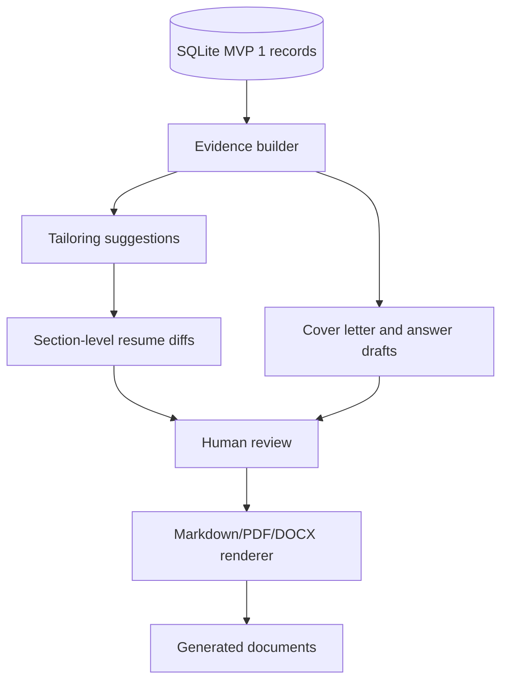

# Tailoring and Documents Phase 2

## Goal

- Plan the phase 2 expansion from evaluation/tracking into resume tailoring, cover letters, open-ended answer drafting, ATS/readability checks, and Markdown/PDF/DOCX rendering.
- Reuse MVP 1 evidence, profile sources, job sources, evaluations, citations, and application history instead of inventing claims.
- Keep this plan deferred until MVP 1 import, evaluation, tracking, clients, and exports are stable.

## Starting Point

- Current behavior:
  - No implementation exists yet.
  - Plans 001-004 define MVP 1. Plan 005 defines automation follow-up.
  - Phase 2 must not begin until MVP 1 provides trustworthy source/evaluation records.
- Current files/docs to read first:
  - `.vault/PLAN.md`
  - `.vault/plans/003-import-evaluate-export-workflows-2026-06-03.md`
  - `.vault/plans/004-interfaces-and-agent-wrappers-2026-06-03.md`
  - `.vault/plans/005-browser-automation-human-review-2026-06-03.md`
  - `.vault/decisions/foundational-architecture-2026-06-03.md`
  - `/home/gilgames/Vault/02_Areas/Career/Res2JobWorks-Plan.md`

## Non-Goals and Boundaries

- Do not start this plan before MVP 1 is verified.
- Do not invent resume claims, accomplishments, dates, employers, skills, endorsements, or relationships.
- Do not make document exports the source of truth.
- Do not auto-submit generated documents or applications.
- Ask before using private dogfooding resume data in tests or examples.

## Related Artifacts

- Research:
  - [x] `.vault/research/project-context-2026-06-03.md`
  - [x] `.vault/research/document-generation-options-2026-06-03.md`
- Decisions:
  - [x] `.vault/decisions/foundational-architecture-2026-06-03.md`
  - [x] `.vault/decisions/document-rendering-stack-2026-06-03.md`
- Solutions:
  - [x] `.vault/solutions/evidence-backed-tailoring-2026-06-03.md`
- Encounters:
  - [ ] `.vault/encounters/document-rendering-encounter-2026-06-03.md`
- Visual companion:
  - [x] `.vault/visuals/001-roadmap-architecture-2026-06-03.html`
- Goal run:
  - [x] `.vault/goals/goal-mvp-evaluation-tracking-2026-06-03/`

## Success Criteria

- [x] Tailoring suggestions are generated from stored profile/resume sources, job sources, and evaluations.
- [x] Resume diffs are section-level, cited, reversible, and reviewable before rendering.
- [x] Cover letters and open-ended answers cite source materials or clearly label inferred suggestions.
- [x] Document rendering supports Markdown first, then PDF/DOCX through an explicit rendering stack.
- [x] ATS/readability checks are deterministic where practical and labeled where model-backed.
- [x] Tests prove generated drafts do not invent unsupported claims from fixture data.
- [x] Provider-reported matches are not treated as supported claims unless they appear in stored profile/citation evidence.

## Architecture Diagram



ASCII fallback:

```text
SQLite evidence -> suggestions/drafts -> human review -> document renderer -> generated files
```

## ADR Summary

- Decision: Treat document generation as phase 2, powered by MVP 1 evidence and human review.
- Drivers:
  - Tailoring needs trustworthy profile/job/evaluation evidence.
  - Generated documents are user-facing and high-risk if unsupported.
  - Rendering stack choices should follow proven data contracts.
- Alternatives considered:
  - Generate resumes first: rejected because evidence/tracking foundation is not ready.
  - Keep document generation out forever: rejected because it is a planned product direction.
  - Use one opaque LLM prompt for all documents: rejected because it weakens citations and reversibility.
- Consequences:
  - This plan stays deferred until MVP 1 is stable.
  - Future document work must preserve provenance and review.
- Promote to `.vault/decisions/`: Yes, when rendering stack and evidence rules are chosen.

## Worktree Session

- Required: Yes
- Recommended command: `bash ~/.agents/skills/core/git-worktree/scripts/worktree-manager.sh create res2jobworks-phase2-documents --from main`
- Expected worktree name: `res2jobworks-phase2-documents`
- Branch plan: `codex/phase2-tailoring-documents`
- Review note: Start only after MVP 1 is accepted and evidence records are stable.

## Execution Steps

- [x] Step 1: Research rendering and evidence options
  - ACTION: Compare Markdown-first, HTML-to-PDF, DOCX, and LibreOffice-based rendering options.
  - IMPLEMENT: Prefer local, inspectable, testable renderers.
  - FILES: `.vault/research/document-generation-options-2026-06-03.md`
  - MIRROR: Local-first principle.
  - GOTCHA: Do not add heavyweight rendering stack before MVP 1 evidence is ready.
  - VALIDATE: Research note review.

- [x] Step 2: Define evidence-backed tailoring contracts
  - ACTION: Add models for suggestions, diffs, claims, source links, and review state.
  - IMPLEMENT: Every claim should link to stored profile/resume/job/evaluation evidence or be labeled as an inference.
  - FILES: `packages/documents/`, `packages/core/`, tests
  - MIRROR: Cited evaluation contracts from plan 003.
  - GOTCHA: No unsupported claims.
  - VALIDATE: Unsupported-claim tests.

- [x] Step 3: Implement resume diffs and review workflow
  - ACTION: Generate section-level diffs for human review.
  - IMPLEMENT: Preserve originals, proposed changes, rationale, and citations.
  - FILES: `packages/documents/src/res2jobworks_documents/`
  - MIRROR: Reversible evaluation record pattern.
  - GOTCHA: Generated diffs must not overwrite canonical profile sources.
  - VALIDATE: Diff/review tests.

- [x] Step 4: Implement letter and answer drafts
  - ACTION: Generate cover letter and application answer drafts.
  - IMPLEMENT: Use evidence builder and clearly label weak support or missing evidence.
  - FILES: `packages/documents/`, `templates/documents/`
  - MIRROR: Provider fake pattern from plan 003.
  - GOTCHA: Avoid false specificity.
  - VALIDATE: Draft provenance tests.

- [x] Step 5: Implement renderers
  - ACTION: Add Markdown, PDF, and DOCX rendering after stack ADR.
  - IMPLEMENT: Record rendering metadata and source evidence.
  - FILES: `packages/documents/`, `.vault/decisions/document-rendering-stack-2026-06-03.md`
  - MIRROR: Export metadata from plan 003.
  - GOTCHA: Rendered documents are artifacts, not canonical data.
  - VALIDATE: Structural rendering tests.

## Code Documentation Contract

- [x] Document modules explain provenance, review, and rendering boundaries.
- [x] Public drafting APIs document provider use, unsupported-claim handling, and side effects.
- [x] Renderer code documents artifact generation and canonical-state boundaries.

## Testing Strategy (TDD)

### TDD Contract

- [x] Red: write unsupported-claim and provenance tests before generation behavior
- [x] Green: implement minimal evidence-backed drafts
- [x] Refactor: improve document structure and rendering while tests stay green

### Test File Plan

- New tests to add:
  - `tests/documents/test_tailoring_suggestion_should_reference_source_evidence.py`
  - `tests/documents/test_resume_diff_should_preserve_original_sections.py`
  - `tests/documents/test_cover_letter_draft_should_label_unsupported_inferences.py`
  - `tests/documents/test_generated_document_should_not_be_canonical_state.py`
  - `tests/documents/test_markdown_renderer_should_include_provenance_metadata.py`
- Naming convention notes:
  - Use behavior labels from `~/.agents/skills/core/tdd-tester/SKILL.md`.

### Coverage Layers

- [x] Unit tests
- [x] Integration tests
- [x] End-to-end or workflow tests
- [x] Edge cases and regressions identified

## Execution Lanes

- Implementation lane: `implementer`
- Validation lane: `validator`
- Review lane: `reviewer`
- Security lane: `security` for private data and provider output review
- Pattern lane: `pattern-detector`

## Goal Run Overlay

- Goal run path: `.vault/goals/goal-mvp-evaluation-tracking-2026-06-03/`
- Role in goal run: Follow-up
- Milestone/task IDs:
  - `M6.T1` Plan phase 2 documents
- Dependencies:
  - `M6.T1` depends on `M3.T1`, `M4.T1`, and preferably `M5.T1`
- Current state: complete
- Handoff source: `.vault/goals/goal-mvp-evaluation-tracking-2026-06-03/handoff.md`

## Verification Contract

- Primary commands:
  - `pytest -q tests/documents`
  - `pytest -q`
  - `ruff check .`
- Required proof of completion:
  - Evidence-backed draft tests pass.
  - Unsupported-claim tests pass.
  - Rendering stack ADR exists.
  - Generated document artifacts trace back to canonical SQLite records.
- Review gates:
  - validator pass: complete
  - pattern pass: complete
  - reviewer approve: complete
  - security pass for private data/provenance: complete

## Review Remediation

- Security finding fixed: `provider_metadata.dimensions.matched_skills` is now raw provider input only. Drafting uses `verified_profile_skills`, which must appear in stored resume/profile citation evidence, and labels unverified provider skills as `unsupported_inferences`.
- Reviewer follow-up fixed: skill verification now requires normalized term or phrase boundaries, preventing arbitrary substring matches such as one-letter provider skills from becoming supported claims.
- Reviewer finding fixed: document rendering writes a unique temporary artifact, records export metadata with a collision-resistant export id, removes the temporary file on metadata failure, and only finalizes the output path after metadata succeeds.
- Reviewer finding fixed: `documents.draft_application_answer` is exposed through the package command wrapper, CLI registry dispatcher, and shared command registry.
- Regression coverage added for provider metadata claim hardening, skill boundary matching, failed export metadata cleanup, and CLI registry application-answer parity.

## Verification Evidence

- `uv run --extra dev pytest -q tests/documents tests/db/test_empty_workspace_should_apply_all_migrations.py tests/db/test_exports_should_reference_canonical_records.py tests/core/test_available_sqlite_commands_should_accept_database_path.py tests/core/test_registry_entries_should_have_required_metadata.py tests/wrappers/test_available_agent_commands_should_match_runner_inputs.py` -> `18 passed`
- `uv run --extra dev pytest -q` -> `97 passed`
- `uv run --extra dev ruff check .` -> `All checks passed!`
- `uv build` -> built `dist/res2jobworks-0.1.0.tar.gz` and `dist/res2jobworks-0.1.0-py3-none-any.whl`

## Review Results

- Validator: `APPROVED`
- Pattern detector: `APPROVED`
- Security: `APPROVED`; previous provider-metadata provenance blocker fixed.
- Reviewer: `APPROVED`; previous renderer finalization, application-answer command parity, and skill-boundary blockers fixed.

## Goal Contract

```text
Objective:
Plan and implement phase 2 tailoring and document generation only after res2jobWorks MVP 1 evidence/tracking is stable.

Starting point:
Plans 001-004 should be complete, and plan 005 should be considered if browser evidence matters. Plan path: `.vault/plans/006-tailoring-documents-phase2-2026-06-03.md`.

Read first:
- `.vault/PLAN.md`
- `.vault/plans/003-import-evaluate-export-workflows-2026-06-03.md`
- `.vault/decisions/foundational-architecture-2026-06-03.md`

Constraints:
- Do not invent unsupported claims.
- Generated documents are artifacts, not canonical data.
- Preserve human review and citations.
- Ask before using private dogfooding data.

Iteration policy:
- Research rendering options first.
- Define evidence-backed contracts before generation.
- Test unsupported-claim behavior before drafting.
- Record rendering stack and evidence decisions.

Verification:
- `pytest -q tests/documents`
- `pytest -q`
- `ruff check .`

Stop conditions:
- Success: tailoring, drafts, and rendered documents are evidence-backed, reviewable, and verified.
- Ask user: private resume data, renderer stack tradeoff, or unsupported claim policy.
- Blocker: generated content cannot preserve provenance.

Final evidence:
- Research/decision paths, test outputs, generated sample artifact paths, and provenance summary.
```

## Durable Artifact Capture Rule

- Capture `.vault/research/document-generation-options-2026-06-03.md` before implementation.
- Capture `.vault/decisions/document-rendering-stack-2026-06-03.md`.
- Capture `.vault/solutions/evidence-backed-tailoring-2026-06-03.md` if provenance patterns become reusable.
- Capture `.vault/encounters/document-rendering-encounter-2026-06-03.md` for renderer, format, or unsupported-claim blockers.

## Risks and Mitigations

| Risk | Likelihood | Impact | Mitigation |
|------|------------|--------|------------|
| Generated documents invent claims | Medium | High | Require source evidence or explicit inference labeling |
| Phase 2 starts before MVP 1 is stable | Medium | High | Keep plan deferred and dependent on plans 001-004 |
| Rendering stack is heavy or brittle | Medium | Medium | Research options and start Markdown-first |
| Private dogfooding data leaks | Medium | High | Ask before private data and keep public fixtures generic |

## Open Questions

- [ ] Which rendering stack should be preferred for PDF/DOCX?
- [ ] What provenance threshold is required for generated resume bullet edits?
- [ ] Should ATS/readability checks be deterministic-only at first?

## Progress Log

- 2026-06-03: Deferred phase 2 plan created to preserve scope boundary.
- 2026-06-04: Implementation activated in worktree `res2jobworks-phase2-documents`; linked rendering research and stack ADR are present.
- 2026-06-04: Implemented evidence loading, tailoring suggestions, reversible resume diffs, cover/application drafts, Markdown/DOCX/PDF artifact renderers, deterministic readiness checks, and document command envelopes. Verification: `uv run --extra dev pytest -q tests/documents` -> 8 passed; `uv run --extra dev pytest -q` -> 93 passed; `uv run --extra dev ruff check .` -> passed; `uv build` -> passed; CLI smoke rendered a PDF cover-letter artifact and recorded export metadata.
